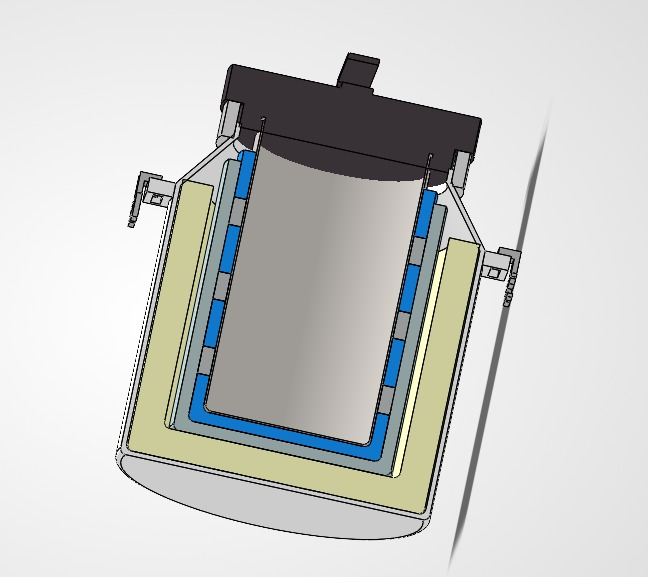
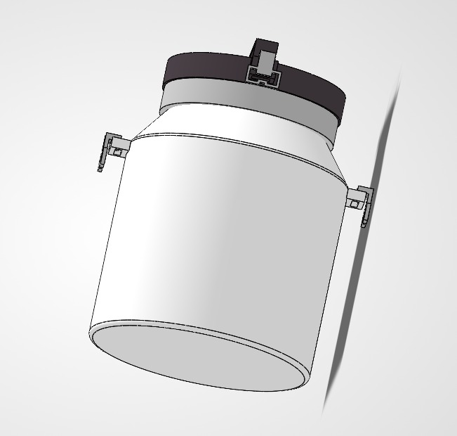
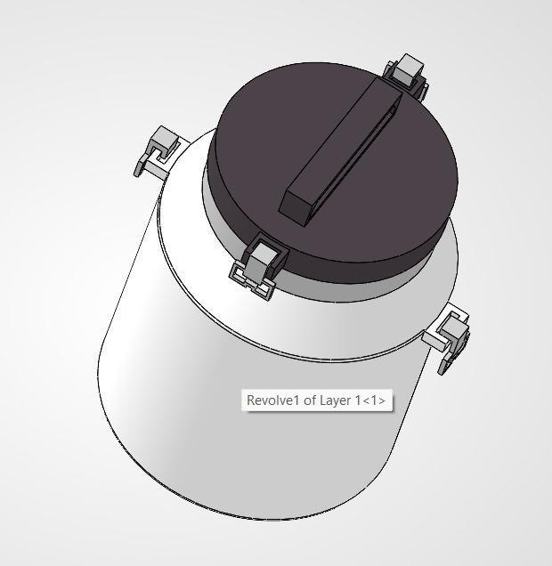
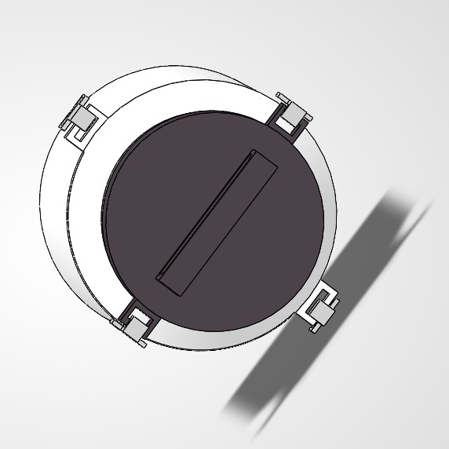
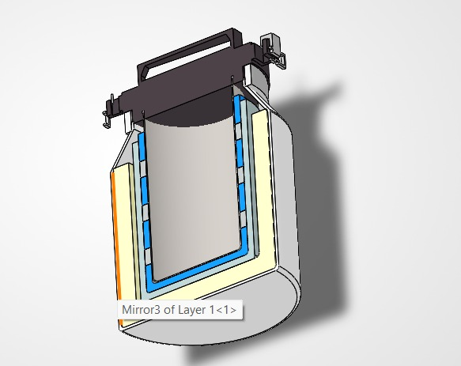

# Lactox – Milk Chilling Can
### Low-Cost, Lightweight Phase Change Material (PCM) Milk Chilling Can for Small-Scale Dairy Farmers


---

## Table of Contents
- [Project Overview](#project-overview)
- [Problem Statement](#problem-statement)
- [Project Objectives](#project-objectives)
- [Basic Working Concept](#basic-working-concept)
- [PCM-Based Cooling Concept](#pcm-based-cooling-concept)
- [Design Approach & Layer Architecture](#design-approach--layer-architecture)
- [Material Selection](#material-selection)
- [SolidWorks CAD Design Views](#solidworks-cad-design-views)
- [Project Documentation](#project-documentation)
- [Demonstration Video](#demonstration-video)
- [Applications](#applications)
- [Key Benefits](#key-benefits)
- [Current Project Status](#current-project-status)
- [Future Scope](#future-scope)
- [Repository Structure](#repository-structure)

---

## Project Overview

**Lactox – Milk Chilling Can** is an off-grid, passive thermal storage container designed to address the critical challenge of milk spoilage during first-mile collection and transit in rural dairy supply chains. 

Targeted primarily at small and marginal dairy farmers in regions with limited or unreliable electrical grid infrastructure, the design incorporates a multi-layer composite structure utilizing **Phase Change Material (PCM)** and **Polyurethane Foam (PUF)** insulation. This passive cooling system is designed to chill and maintain fresh milk within safe preservation temperatures (4°C–8°C) without requiring continuous electricity or motorized refrigeration during transportation.

---

## Problem Statement

* **Problem Statement ID:** 26110
* **Ministry / Department:** Ministry of Fisheries, Animal Husbandry & Dairying | Department of Animal Husbandry & Dairying
* **Category:** Hardware (Agriculture, FoodTech & Rural Development)

### Background:
Milk is a perishable agricultural commodity that deteriorates rapidly after milking due to bacterial growth and enzymatic activity if not promptly chilled. In many rural and remote regions (particularly hilly terrains and North-Eastern regions), small-scale farmers lack access to localized Bulk Milk Coolers (BMCs) and face frequent power outages.

As a result:
- Milk frequently remains exposed to ambient temperatures for several hours between milking and delivery to village collection centers.
- Spoilage and bacterial proliferation lead to curdling, degradation of milk quality, and severe financial losses for farmers.
- Conventional stainless steel transport cans are heavy, uninsulated, expensive, and offer no active or passive chilling mechanism during transit.

---

## Project Objectives

1. **Passive Temperature Maintenance:** Design a thermal storage container capable of maintaining milk between 4°C and 8°C for 6 to 12 hours under typical ambient conditions without continuous electrical power.
2. **Lightweight & Ergonomic Structure:** Utilize high-strength, food-grade polymeric and lightweight composite materials to significantly reduce tare weight compared to traditional all-steel containers.
3. **Affordable & Scalable:** Ensure the container architecture uses cost-effective, readily available materials suited for rural manufacturing and adoption by smallholder dairy farmers.
4. **Hygienic & Food-Safe:** Incorporate sanitary food-grade inner contact surfaces and leak-proof sealing to prevent contamination and bacterial retention.
5. **Practical Target Capacity:** Accommodate a 30 to 40 liter volume suitable for standard farm-to-collection center transport.

---

## Basic Working Concept

The Lactox Milk Chilling Can operates on a **triple-barrier passive thermal control principle**:

1. **Conductive Heat Absorption (Core):** Fresh milk poured into the central chamber transfers its sensible heat through the high-conductivity food-grade inner vessel directly to the surrounding thermal jacket.
2. **Latent Heat Storage (Jacket):** The thermal jacket contains pre-cooled Phase Change Material (PCM) packs that absorb heat at a constant phase transition temperature, suppressing temperature rise in the milk.
3. **Convective & Radiative Thermal Shielding (Insulation & Shell):** An outer annular layer of closed-cell Polyurethane Foam (PUF) insulation drastically minimizes heat ingress from the ambient environment, while a hermetic lid gasket eliminates convective warm-air exchange.

---

## PCM-Based Cooling Concept

Phase Change Materials (PCMs) provide substantial thermal energy storage capacity through latent heat of fusion during phase transition (solid to liquid):

* **Selected PCM Medium:** Reusable Propylene Glycol PCM packs.
* **Non-Electric Operation:** The PCM packs are pre-conditioned/frozen in a standard domestic or dairy cooperative freezer prior to the collection run.
* **Thermal Buffering:** When placed inside the can's jacket around the milk chamber, the packs steadily absorb the heat from fresh milk while maintaining a near-constant melting plateau (targeting the 4°C to 8°C safe zone).
* **Safety:** Propylene glycol formulations are non-toxic, chemically stable, food-safe, and reusable across multiple daily milking cycles.

---

## Design Approach & Layer Architecture

The container is engineered with a concentric multi-layer architecture visible in the design section views:

```
[Outer Environment]
  │
  ├── 1. Outer Protective Shell (HDPE / Powder-Coated Lightweight Alloy)
  │      └── Impact resistance, structural rigidity, weather shielding
  │
  ├── 2. Intermediate Insulation Layer (Polyurethane Foam - PUF)
  │      └── High thermal resistance, stops external heat ingress
  │
  ├── 3. Internal Secondary Casing (LDPE Lining)
  │      └── Structural separation, moisture barrier, holds PCM modules
  │
  ├── 4. PCM Thermal Jacket (Propylene Glycol PCM Packs)
  │      └── Circumferential 360° latent heat absorption
  │
  ├── 5. Inner Milk Container (SS304 / SS305 Food-Grade Stainless Steel)
  │      └── Sanitary, non-corrosive, rapid thermal transfer to PCM
  │
[Raw Milk Core]
```

### Sealing & Handling Details:
* **Sealing Lid:** Features a fitted food-grade silicone compression gasket held under positive pressure by mechanical toggle clamp latches to ensure leak-proof transport over rough rural roads.
* **Ergonomics:** Heavy-duty side handles and top lid handle positioned for safe single-person or two-person loading onto bicycles, motorcycles, or small transport vehicles.

---

## Material Selection

Materials were selected based on thermal performance, structural durability, food contact hygiene, weight reduction, and cost-efficiency (as detailed in `Documentation/Material_Selection.pdf`):

| S.No. | Material / Component | Subsystem / Location | Primary Functional Rationale |
|:---:|:---|:---|:---|
| **1** | **High-Density Polyethylene (HDPE)** | Outer Shell & Structural Base | High strength-to-weight ratio, impact resistance, UV resistance, and corrosion-free outer enclosure. |
| **2** | **Polyurethane Foam (PUF)** | Intermediate Insulation Wall | Exceptionally low thermal conductivity; prevents environmental ambient heat infiltration. |
| **3** | **Low-Density Polyethylene (LDPE)** | Internal Lining & PCM Housings | Flexible, moisture-resistant, lightweight separation barrier holding the thermal packs. |
| **4** | **Propylene Glycol PCM Packs** | Thermal Cooling Jacket (360°) | High latent heat capacity, non-toxic, safe thermal stabilization in the 4°C–8°C range. |
| **5** | **SS304 / SS305 Stainless Steel** | Inner Sanitary Milk Chamber | Food-grade contact surface, non-reactive, smooth, easy to clean/sterilize, high thermal conductivity. |
| **6** | **Silicone Gasket** | Lid Compression Seal | Food-grade elastomeric seal providing airtight closure, preventing leakage and convective thermal losses. |

---

## SolidWorks CAD Design Views

> **Note:** The CAD design was developed and modeled in **SolidWorks**. The images in this repository represent captured views and section screenshots from the 3D model (raw parametric `.SLDPRT` / `.SLDASM` CAD files are proprietary and not included in this public repository).

### 1. Cross-Sectional View
Shows the concentric layering including the inner stainless steel chamber, circumferential PCM cooling packet layer, thick PUF insulation wall, and external shell.



### 2. Front / Assembly View
Overall external assembly showing the cylindrical profile, neck taper, base rim, and latch clamps.



### 3. Side View
Side profile displaying ergonomic handle positioning and lid clamp alignment.



### 4. Top View
Top-down view displaying the lid handle, circular geometry, and clamp latch distribution.



### 5. Multi-Layer Cutaway View
3D isometric section view detailing the concentric wall boundaries and thermal barrier interface.



---

## Project Documentation

Technical documents and problem statement specifications are located in the [`Documentation/`](Documentation/) folder:

* [`Documentation/Project_Report.pdf`](Documentation/Project_Report.pdf): Problem statement specification report (Problem Statement ID 26110, Ministry of Fisheries, Animal Husbandry & Dairying) covering background, rural challenges, design objectives, and expected outcomes.
* [`Documentation/Project_Report.docx`](Documentation/Project_Report.docx): Editable word document version of the project problem statement details.
* [`Documentation/Material_Selection.pdf`](Documentation/Material_Selection.pdf): Illustrated visual chart documenting the six primary materials and components selected for the chilling can.

---

## Demonstration Video

A 3D CAD screen-recording demonstration is provided in the [`Demonstration/`](Demonstration/) directory:

* **File:** [`Demonstration/SolidWorks_Design_Demonstration.mp4`](Demonstration/SolidWorks_Design_Demonstration.mp4)
* **Description:** A screen recording walkthrough demonstrating the 3D SolidWorks model, displaying component geometry, internal section views, and spatial assembly of the milk chilling can.

---

## Applications

* **First-Mile Rural Milk Collection:** Transporting morning and evening milk yields from remote dairy farms to Village Level Collection Centres (VLCC).
* **Hilly & Remote Dairy Belts:** Ideal for regions lacking reliable grid power, where conventional electric refrigeration or bulk milk coolers are unavailable.
* **Smallholder & Marginal Farmers:** Provides an individual or cluster-level chilling solution that eliminates dependency on immediate centralized cooling.
* **Small Dairy Logistics:** Inter-village transit of perishable dairy products on two-wheelers, small carts, and pickup vehicles.

---

## Key Benefits

* **Zero Electricity Required During Transit:** Operates 100% passively on pre-frozen PCM packs.
* **Substantial Weight Reduction:** Outer HDPE composite construction reduces dead weight compared to traditional heavy cast-metal containers.
* **Prevents Spoilage & Financial Loss:** Maintains safe chilling conditions to inhibit bacterial souring and preserve fat/SNF quality.
* **Hygienic & Easy to Clean:** Food-grade SS304/SS305 interior meets dairy sanitation standards and withstands regular CIP/manual washdowns.
* **Durable & Field-Ready:** Outer shell and shock-absorbent base protect thermal layers against transit vibrations and impacts.

---

## Current Project Status

- [x] Problem statement analysis and operational requirements definition
- [x] Material evaluation and selection (SS304, PUF, PCM, HDPE, LDPE, Silicone)
- [x] 3D CAD modeling and multi-layer assembly in SolidWorks
- [x] Cross-sectional and orthogonal view generation
- [x] CAD screen-recording video demonstration
- [ ] Physical prototype fabrication and assembly
- [ ] Experimental thermal testing and temperature retention curve logging (no experimental sensor data is included in this phase)
- [ ] Field trials with dairy cooperative collection routes

---

## Future Scope

1. **Physical Prototype Fabrication:** Procuring food-grade raw materials and fabricating a working 30–40 L prototype unit.
2. **Experimental Temperature Logging:** Conducting controlled environmental chamber tests with calibrated temperature sensors to record real-world chilling curves and validate hold times across varying ambient temperatures.
3. **Digital Temperature Monitoring Integration:** Incorporating an external digital temperature indicator with an internal probe and optional low-power data logger for live temperature verification.
4. **Quick-Swap PCM Cartridge Design:** Refining the jacket geometry for faster insertion and removal of frozen PCM packs between milking shifts.
5. **Field Testing & Farmer Feedback:** Deploying prototypes on active collection routes to assess ergonomic handling, durability, and practical ease of washing in rural environments.

---

## Repository Structure

```text
Lactox-Milk-Chilling-Can/
├── README.md
├── Design/
│   ├── Cross_Sectional_View.jpg
│   ├── Front_View.jpg
│   ├── Layers_View.jpg
│   ├── Side_View.jpg
│   └── Top_View.jpg
├── Documentation/
│   ├── Material_Selection.pdf
│   ├── Project_Report.docx
│   └── Project_Report.pdf
└── Demonstration/
    └── SolidWorks_Design_Demonstration.mp4
```

---

*Project developed for the Smart India Hackathon (SIH) under Problem Statement ID 26110.*
